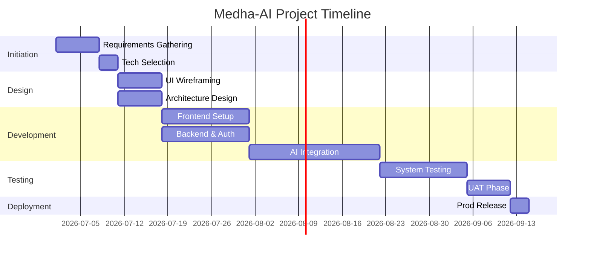

# Project Management Documentation
**Project Name:** Medha-AI  
**Team Size:** 8  

---

## 1. Work Breakdown Structure (WBS)
1. **Initiation Phase**
   - 1.1 Requirements Gathering
   - 1.2 Technology Selection
   - 1.3 Feasibility Analysis
2. **Design Phase**
   - 2.1 UI/UX Wireframing
   - 2.2 System Architecture Design
   - 2.3 Database Schema Design
3. **Development Phase**
   - 3.1 Frontend Development
   - 3.2 Backend API Development
   - 3.3 AI Model Integration
4. **Testing Phase**
   - 4.1 Unit Testing
   - 4.2 System Integration Testing
   - 4.3 User Acceptance Testing (UAT)
5. **Deployment & Closure**
   - 5.1 Staging Deployment
   - 5.2 Production Release
   - 5.3 Documentation Handover

## 2. Sprint Planning (Agile Methodology)
- **Sprint Duration:** 2 Weeks
- **Sprint 1:** Setup environments, DB schema, basic UI scaffolding.
- **Sprint 2:** Auth integration, File upload API.
- **Sprint 3:** PDF Parsing, Text chunking, pgvector setup.
- **Sprint 4:** LLM integration (Flashcards/Quizzes).
- **Sprint 5:** Chatbot RAG implementation, UI polish.
- **Sprint 6:** QA Testing, Bug fixes, Production Deployment.

## 3. Milestones
| Milestone | Description | Target Date |
|---|---|---|
| M1 | MVP Architecture Finalized | Week 2 |
| M2 | Core Parsing Logic Complete | Week 5 |
| M3 | AI Features Functional | Week 8 |
| M4 | Alpha Testing Sign-off | Week 10 |
| M5 | Production Release | Week 12 |

## 4. Risk Register
| Risk ID | Description | Impact | Probability | Mitigation Strategy |
|---|---|---|---|---|
| R-01 | LLM API downtime or rate limits | High | Medium | Implement retry logic and fallback models. Limit free user usage. |
| R-02 | Large PDFs crash the backend | High | High | Implement asynchronous processing and file size limits (50MB). |
| R-03 | Scope Creep (Adding video support early) | Medium | Medium | Strict adherence to MVP features during Sprints 1-6. |
| R-04 | Team member unavailability | Medium | Low | Maintain robust documentation and cross-train developers. |

## 5. Resource Allocation
| Role | Count | Responsibilities |
|---|---|---|
| Project Manager | 1 | Sprint planning, risk management, stakeholder communication. |
| UI/UX Designer | 1 | Wireframes, prototypes, user journey mapping. |
| Frontend Dev | 2 | React components, API integration, State management. |
| Backend Dev | 2 | FastAPI endpoints, async tasks, Supabase DB logic. |
| AI Engineer | 1 | Prompt engineering, RAG pipeline, embedding optimization. |
| QA Engineer | 1 | Test case writing, automated testing, manual UAT. |

## 6. Project Timeline (Gantt Chart Data)

