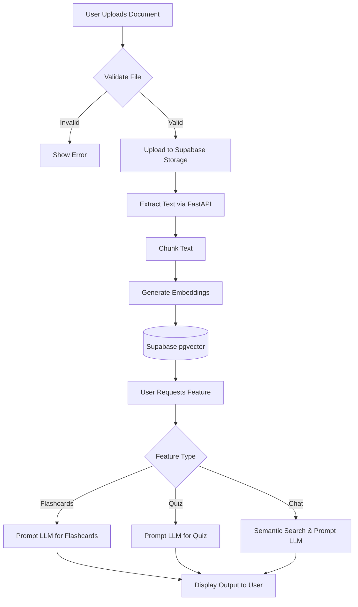

# Functional Requirements Document (FRD)
**Project Name:** Medha-AI  
**Domain:** Artificial Intelligence (AI)  

---

## 1. Module-wise Functionality

### 1.1 User Management Module
Handles user registration, authentication, and profile settings.
- **Registration/Login:** Secure access using JWT tokens via Supabase Auth.
- **Profile Management:** Users can update their display name, email, and preferences.

### 1.2 Document Processing Module
Manages the ingestion and parsing of study materials.
- **File Upload:** Handles file validation (type/size) and uploads to cloud storage.
- **Text Extraction:** Parses text and metadata from uploaded documents.
- **Vectorization:** Converts text into embeddings and stores them in Supabase pgvector.

### 1.3 AI Generation Module
Core module for generating educational content.
- **Flashcard Generator:** Prompts LLM to identify key terms and definitions.
- **Quiz Generator:** Creates multiple-choice questions with distractors and explanations.
- **Q&A Chatbot:** Retrieves relevant context (RAG) and formulates an answer based on user query.

---

## 2. Inputs and Outputs

| Function | Inputs | Outputs |
|---|---|---|
| File Upload | PDF, DOCX, TXT files (Max 50MB) | File URL, Extracted Text payload |
| Flashcard Generation | Extracted Text, Quantity requested | JSON array of Question/Answer pairs |
| Quiz Generation | Extracted Text, Difficulty level | JSON array of Questions, Options, Correct Answer |
| Chatbot Query | User query (string), Document Context | AI Response (string), Source citations |

---

## 3. Business Logic
- **Content Grounding:** The chatbot must strictly refuse to answer questions if the context is not found in the uploaded documents to prevent hallucinations.
- **Rate Limiting:** Users are limited to 50 AI generation requests per day to manage API costs.
- **Data Retention:** Uploaded documents are retained as long as the user's account is active, but vectorized chunks might be cached for only 30 days of inactivity.

---

## 4. User Workflows
1. **Onboarding:** User Lands on Homepage -> Signs Up -> Confirms Email -> Redirected to Dashboard.
2. **Study Session:** User Uploads PDF -> System Parses -> User Selects "Generate Flashcards" -> Reviews Flashcards -> Starts Quiz -> Views Score.
3. **Clarification:** User reads a document -> Does not understand a concept -> Opens Chat interface -> Types question -> Receives grounded answer.

---

## 5. Process Flow

---

## 6. Screen Descriptions
- **Login/Signup Screen:** Standard form with Email/Password and "Continue with Google" button.
- **Dashboard:** Displays recent documents, progress statistics, and an "Upload New Document" drag-and-drop zone.
- **Document View:** Split screen. Left side: PDF Viewer. Right side: Tabbed interface for Flashcards, Quiz, and Chat.
- **Quiz Interface:** Interactive multiple-choice format with immediate feedback on correct/incorrect answers.

---

## 7. Functional Dependency Mapping
| Module | Dependent On | External Dependency |
|---|---|---|
| Vectorization | Document Processing | OpenAI Embeddings API (or equivalent) |
| Q&A Chatbot | Vectorization, Storage | LLM Provider API (e.g., GPT-4) |
| User Profile | Authentication | Supabase Auth |
| File Storage | Document Processing | Supabase Storage Buckets |
