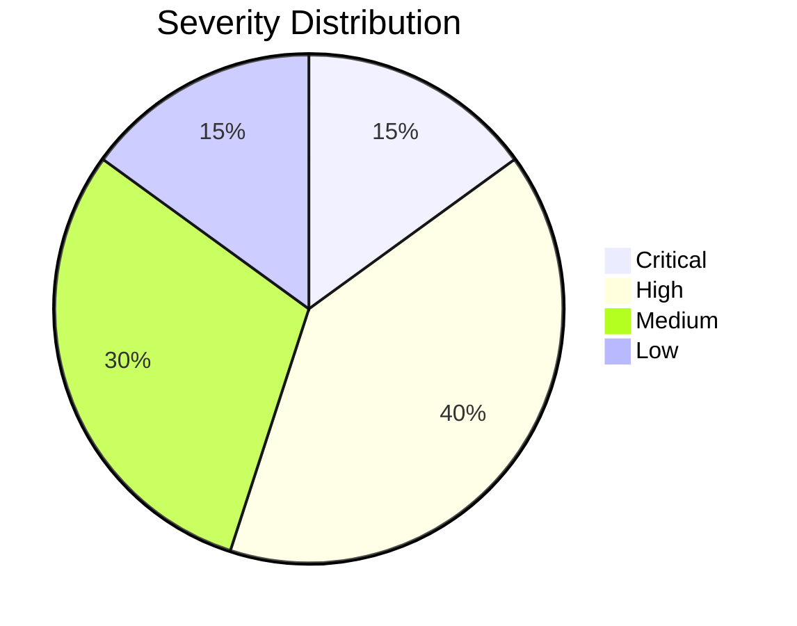
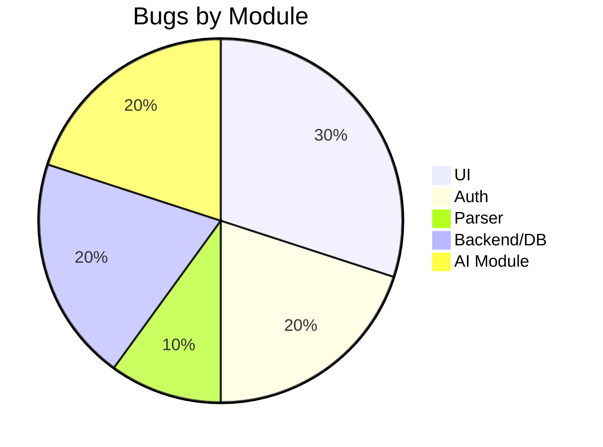
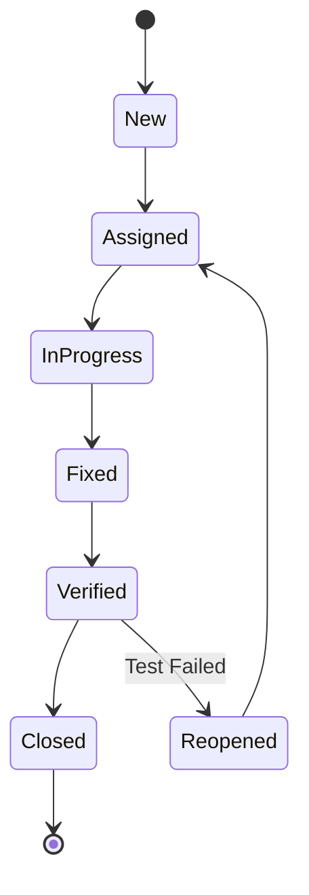

# Bug Tracking and Defect Management Document
**Project Name:** Medha-AI  
**Domain:** Artificial Intelligence (AI)  

---

## 1. Defect Logging Structure
Every bug logged in the system must contain the following fields:
- **Defect ID:** Unique identifier (e.g., BUG-001)
- **Defect Title:** Short description of the issue
- **Module:** The component where the bug occurred (e.g., Auth, UI, Parser)
- **Severity:** Critical, High, Medium, Low
- **Priority:** High, Medium, Low
- **Environment:** Dev, QA, Staging, Production
- **Steps to Reproduce:** Clear, numbered steps to replicate the bug
- **Expected Result:** What the system should do
- **Actual Result:** What the system is currently doing
- **Root Cause Analysis (RCA):** Reason for the failure (added after investigation)
- **Fix Description:** How the bug was resolved
- **Status:** New, Assigned, In Progress, Fixed, Verified, Closed
- **Assigned To:** Developer handling the fix
- **Resolution Date:** Date when the bug was closed

---

## 2. Sample Bug Log (Minimum 20 realistic bugs)

| Defect ID | Title | Module | Severity | Priority | Status |
|---|---|---|---|---|---|
| BUG-001 | Login fails with valid Google OAuth credentials | Auth | Critical | High | Closed |
| BUG-002 | PDF parser crashes on files > 20MB | Parser | High | High | Fixed |
| BUG-003 | "Generate Flashcards" button unresponsive after first click | UI | Medium | High | Closed |
| BUG-004 | Chatbot hallucinates answers not in document | AI Module | Critical | High | In Progress |
| BUG-005 | Special characters in DOCX files render as '?' | Parser | Medium | Medium | Fixed |
| BUG-006 | Quiz score calculation incorrect (shows 110%) | Logic | High | High | Closed |
| BUG-007 | Missing CORS headers on FastAPI endpoints | Backend | High | High | Closed |
| BUG-008 | Dashboard pie chart colors overlap | UI | Low | Low | Open |
| BUG-009 | Email verification link expires instantly | Auth | High | High | Fixed |
| BUG-010 | Supabase pgvector query times out on large documents | Database | High | Medium | Investigating |
| BUG-011 | User profile image fails to upload | UI/Storage | Medium | Medium | Closed |
| BUG-012 | Dark mode toggle does not persist across sessions | UI | Low | Low | Fixed |
| BUG-013 | Chat interface does not auto-scroll to latest message | UI | Medium | Medium | Closed |
| BUG-014 | Rate limit exceeded error shown on first request | Backend | High | High | Closed |
| BUG-015 | Flashcards API returns empty array for single-page PDFs | AI Module | Medium | Medium | Fixed |
| BUG-016 | "Export to CSV" downloads an empty file | Backend | Medium | Low | Open |
| BUG-017 | Typo in password reset email template | Auth | Low | Low | Closed |
| BUG-018 | Mobile view navigation menu overlaps content | UI | High | Medium | Fixed |
| BUG-019 | Supabase Auth token refresh fails after 1 hour | Auth | Critical | High | Closed |
| BUG-020 | Long chat messages overflow the chat container | UI | Medium | Low | Fixed |

---

## 3. Defect Summary Report
**Total Defects Logged:** 20  
**Closed/Fixed:** 15  
**In Progress/Investigating:** 2  
**Open/New:** 3  
**Defect Resolution Rate:** 75%

---

## 4. Bug Metrics Dashboard

### Severity Distribution

### Module Distribution

---

## 5. Defect Lifecycle

