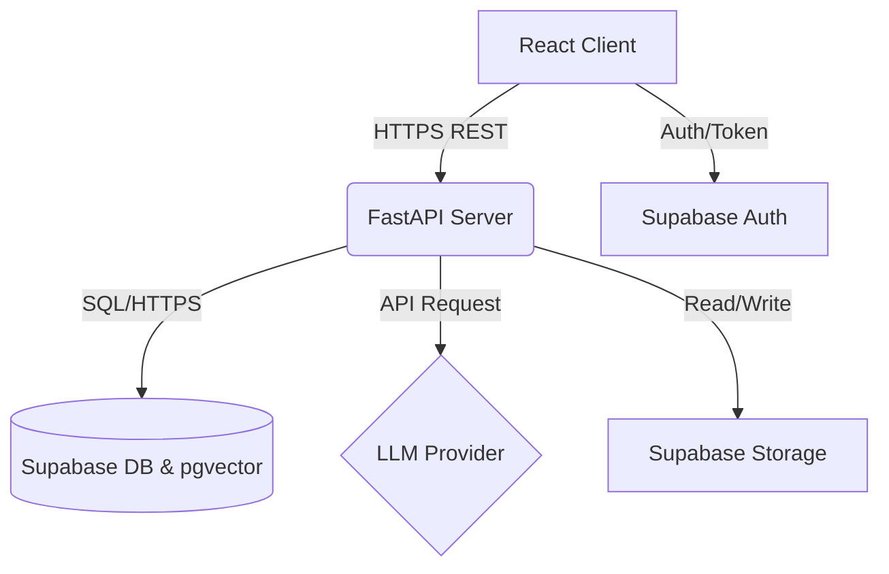
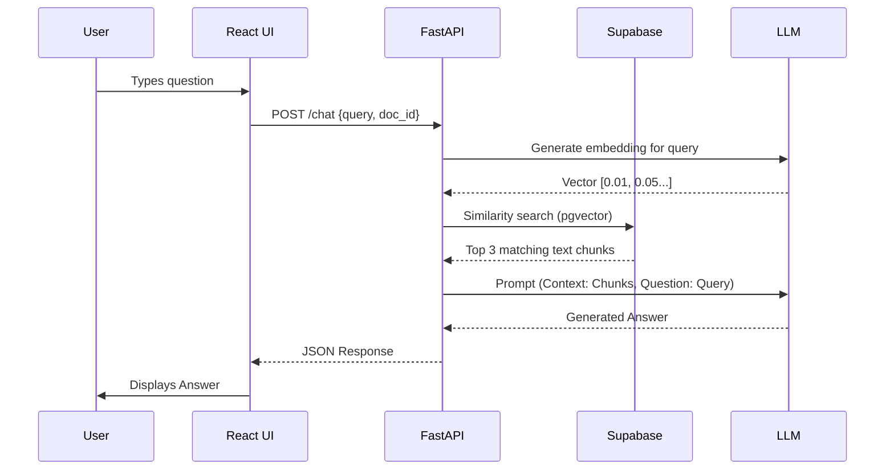
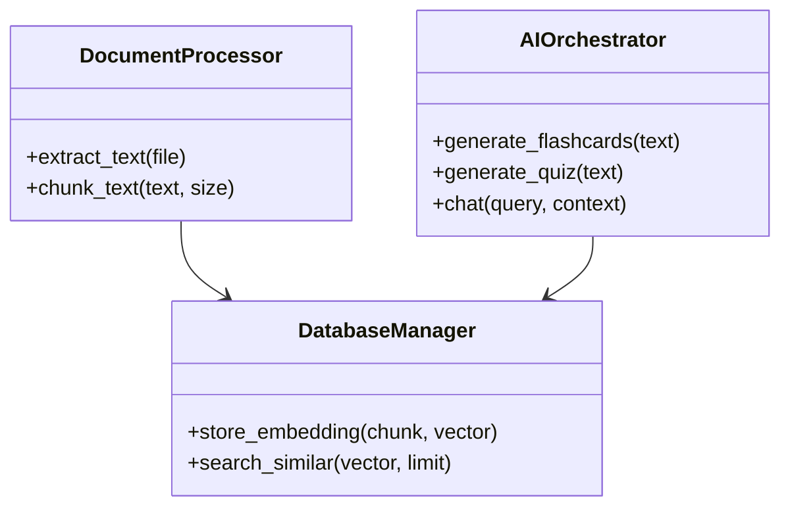

# Technical Design Document (TDD)
**Project Name:** Medha-AI  
**Domain:** Artificial Intelligence (AI)  

---

## 1. System Architecture
Medha-AI is built on a modern, decoupled microservices-inspired architecture. 
- **Client Tier:** A React single-page application (SPA) providing a dynamic user interface.
- **API/Application Tier:** A FastAPI server handling complex business logic, AI orchestration, and file processing asynchronously.
- **Data/Storage Tier:** Supabase providing PostgreSQL (with pgvector), authentication, and blob storage.
- **AI Tier:** External Large Language Model (LLM) APIs for text generation and embeddings.

## 2. Technology Stack Justification
| Component | Technology | Justification |
|---|---|---|
| Frontend | React | Component-based, vast ecosystem, high performance via virtual DOM. |
| Backend | FastAPI (Python) | High-speed asynchronous support, native Python AI/ML ecosystem compatibility, automatic Swagger documentation. |
| Database | Supabase (Postgres) | Open-source Firebase alternative. `pgvector` extension is critical for vector similarity search needed for RAG. |
| File Storage | Supabase Storage | Seamless integration with DB and Auth for securing user documents. |
| Authentication | Supabase Auth | Out-of-the-box secure JWT management, email/password, and OAuth providers. |

## 3. Database Design
### Key Tables
1. **Users:** `id` (UUID), `email`, `created_at`, `full_name`
2. **Documents:** `id` (UUID), `user_id` (FK), `file_url`, `filename`, `upload_date`
3. **Document_Chunks:** `id`, `document_id` (FK), `chunk_text`, `embedding` (vector(1536))
4. **Flashcards:** `id`, `document_id` (FK), `front_text`, `back_text`
5. **Quizzes:** `id`, `document_id` (FK), `score`, `taken_at`

## 4. API Design
*Base URL: `/api/v1`*

| Endpoint | Method | Description | Payload/Params |
|---|---|---|---|
| `/upload` | POST | Uploads and parses document | `multipart/form-data` (file) |
| `/documents` | GET | Fetches user's documents | Header: Bearer Token |
| `/generate/flashcards` | POST | Generates flashcards | `{ "document_id": "uuid", "count": 10 }` |
| `/generate/quiz` | POST | Generates a quiz | `{ "document_id": "uuid", "difficulty": "medium" }` |
| `/chat` | POST | Q&A with document context | `{ "document_id": "uuid", "query": "string" }` |

## 5. Component Diagram

## 6. Sequence Diagram: Chatbot Query (RAG)

## 7. Class Diagram (Backend Snippet)

## 8. Deployment Architecture
- **Frontend Hosting:** Vercel or Netlify (CI/CD connected to main branch).
- **Backend Hosting:** Containerized via Docker, deployed to AWS ECS, Heroku, or Render.
- **Database:** Supabase managed cloud instance.
